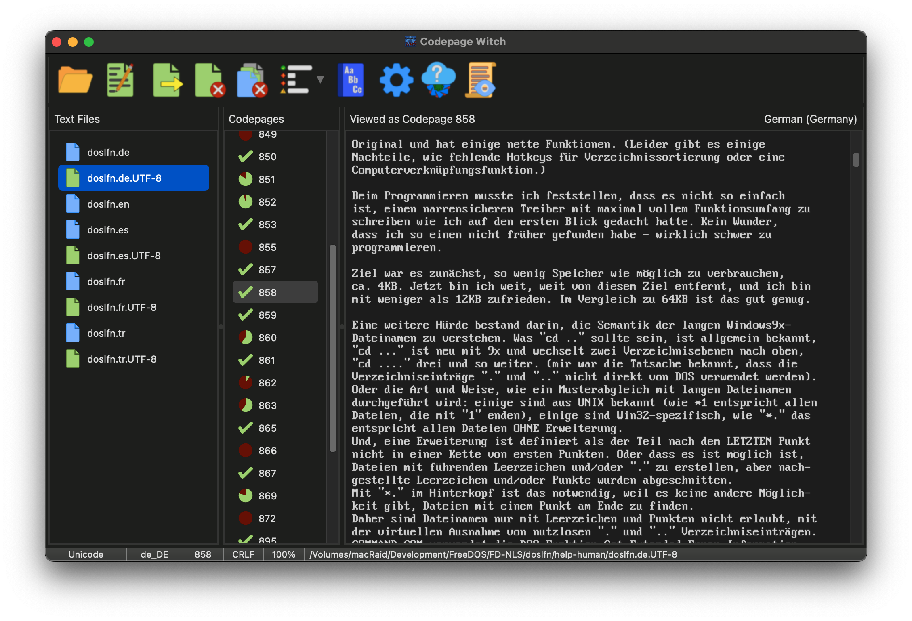

# The Codepage Witch
Utility to help determine the appropriate codepage for a UTF-8 encoded text file.

Pre-compiled versions of the Codepage Witch are available for
[macOS](https://up.lod.bz/CPWitch/macOS/x86_64),
[Linux](https://up.lod.bz/CPWitch/Linux/x86_64) and
[Windows](https://up.lod.bz/CPWitch/Windows/x86_64).

Requires the [MPLA framework](https://gitlab.com/mpla-oss/mpla) to compile.
