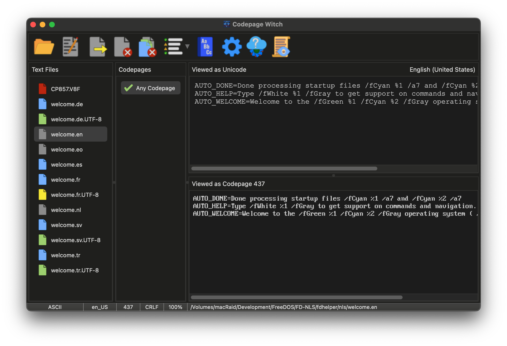

# The Codepage Witch
A utility to help determine the appropriate codepage for a UTF-8 encoded Unicode
text file and perform a conversion to codepage text for DOS. Oh, and of course,
it will go the opposite direction as well.

Pre-compiled versions of the Codepage Witch are available for
[macOS](https://up.lod.bz/CPWitch/macOS/x86_64),
[Linux](https://up.lod.bz/CPWitch/Linux/x86_64) and
[Windows](https://up.lod.bz/CPWitch/Windows/x86_64).

You can also view the [manual online](https://fd.lod.bz/cpwitch).

Requires the [Lazarus](https://www.lazarus-ide.org/) and the
[MPLA framework](https://gitlab.com/mpla-oss/mpla) to compile.
