[parent index](../index.md)  

# CompatBlue Icon Group
## Icon size 128x128  
| Name | Color |
|------|-------|
| CompatBlue_000 | 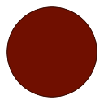 | 
| CompatBlue_005 |  | 
| CompatBlue_010 | 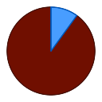 | 
| CompatBlue_015 |  | 
| CompatBlue_020 | 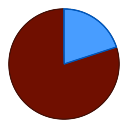 | 
| CompatBlue_025 | 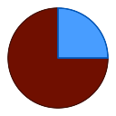 | 
| CompatBlue_030 |  | 
| CompatBlue_035 |  | 
| CompatBlue_040 |  | 
| CompatBlue_045 | 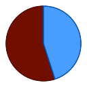 | 
| CompatBlue_050 | 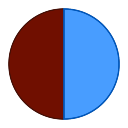 | 
| CompatBlue_055 |  | 
| CompatBlue_060 |  | 
| CompatBlue_065 |  | 
| CompatBlue_070 | 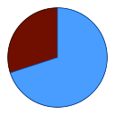 | 
| CompatBlue_075 | 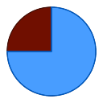 | 
| CompatBlue_080 | 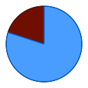 | 
| CompatBlue_085 | 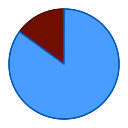 | 
| CompatBlue_090 | 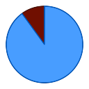 | 
| CompatBlue_095 | 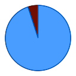 | 
| CompatBlue_100 |  | 
  
