[parent index](../index.md)  

# CompatGreen Icon Group
## Icon size 128x128  
| Name | Color |
|------|-------|
| CompatGreen_000 | 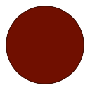 | 
| CompatGreen_005 | 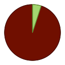 | 
| CompatGreen_010 | 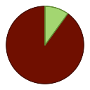 | 
| CompatGreen_015 |  | 
| CompatGreen_020 | 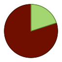 | 
| CompatGreen_025 | 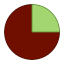 | 
| CompatGreen_030 | 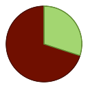 | 
| CompatGreen_035 |  | 
| CompatGreen_040 |  | 
| CompatGreen_045 | 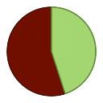 | 
| CompatGreen_050 | 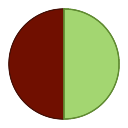 | 
| CompatGreen_055 | 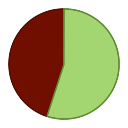 | 
| CompatGreen_060 |  | 
| CompatGreen_065 |  | 
| CompatGreen_070 |  | 
| CompatGreen_075 | 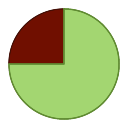 | 
| CompatGreen_080 | 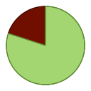 | 
| CompatGreen_085 | 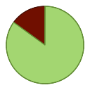 | 
| CompatGreen_090 | 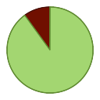 | 
| CompatGreen_095 | 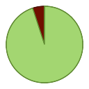 | 
| CompatGreen_100 |  | 
  
